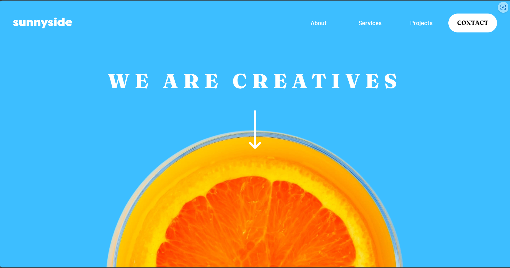

# Frontend Mentor - Sunnyside agency landing page solution

This is a solution to the [Sunnyside agency landing page challenge on Frontend Mentor](https://www.frontendmentor.io/challenges/sunnyside-agency-landing-page-7yVs3B6ef). Frontend Mentor challenges help you improve your coding skills by building realistic projects.

## Table of contents

- [Overview](#overview)
  - [The challenge](#the-challenge)
  - [Screenshot](#screenshot)
  - [Links](#links)
- [My process](#my-process)
  - [Built with](#built-with)
  - [What I learned](#what-i-learned)
  - [Continued development](#continued-development)
  - [Useful resources](#useful-resources)
- [Author](#author)
- [Acknowledgments](#acknowledgments)


### The challenge

Users should be able to:

- View the optimal layout for the site depending on their device's screen size
- See hover states for all interactive elements on the page

### Screenshot




### Links

- Solution URL: [Heres my solution](https://www.frontendmentor.io/solutions/responsive-design-with-tailwind-css-and-react-js-WFV_8ZQSBS)
- Live Site URL: [Live Preview](https://sunnyside-agency-landing-page-pi-nine.vercel.app/)

## My process

### Built with

- Semantic HTML5 markup
- CSS custom properties
- Flexbox
- CSS Grid
- Mobile-first workflow
- Tailwind css
- React js 
- Typescript
- Framer Motion
- AOS
- [React](https://reactjs.org/) - JS library
- [Tailwind css](https://tailwindcss.com/) - CSS Framework


### What I learned

In this project i was able to  apply my knowledge of responsive design, use flexbox and grid in a real world scenario. Also
In this project, I had to use ReactJS in combination with TailwindCSS to create a responsive website from scratch. This was also my first time working with typescript, so it was fulfilling after i finished this project.  
In this project, I had to use Framer Motion and AOS to create a visually appealing website that is responsive and animated.

To see how you can add code snippets, see below:


```js
{projectData.map((project) => (
    <div
      data-aos={project.animate}
      data-aos-delay={project.delay}
      data-aos-once={true}
      key={project.id}
      className="relative"
    >
      
      
      <div className="absolute inset-0 bg-black/10"></div>
    </div>
  ))}
```


### Continued development

I have use react and typescript here together and  it was a great experience to learn about both of them. And I want to be more efficient in both of them. Also I am working on improving my tailwind css to be able to create more appealing website.


### Useful resources

- [Example resource 1](https://tailwindcss.com/) - This helped me a lot in this project. When ever i got stock with something in styling process i just look it up here. Its very straight forward and easy to understand.


## Author

- Website - [Juan carlos Padillo]()
- Frontend Mentor - [@pads-sama](https://www.frontendmentor.io/profile/yourusername)
- Twitter - [@pads_369](https://twitter.com/pads_369)


